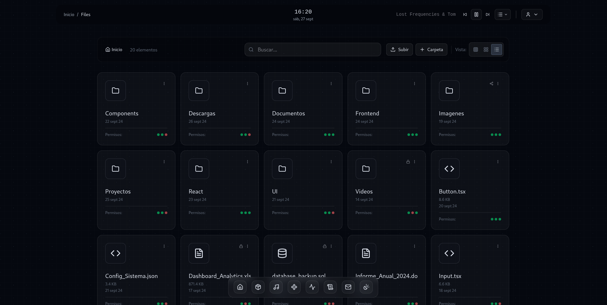

# Cubert - Sistema de Archivos Futurista

Sistema de gestión de archivos con interfaz futurista inspirada en la película "Passengers", implementado con arquitectura hexagonal.

## 📸 Vista Previa



*Interfaz principal de Cubert mostrando el explorador de archivos con diseño futurista*

## 🏗️ Estructura del Proyecto

```
cubert/
├── backend/                    # API Backend (Go)
│   ├── api/                   # Rutas y documentación API
│   ├── cmd/                   # Punto de entrada de la aplicación
│   └── internal/              # Lógica de negocio interna
├── client/                    # Frontend (React + TypeScript)
│   ├── src/
│   │   ├── app/              # Configuración de la aplicación
│   │   ├── shared/           # Componentes y utilidades compartidas
│   │   ├── modules/          # Módulos con arquitectura hexagonal
│   │   └── assets/           # Recursos estáticos
│   └── components/           # Componentes de UI primitivos
└── .devcontainer/            # Configuración del contenedor de desarrollo
```

## ✨ Características

### 🎨 **Diseño Futurista**
- Interfaz inspirada en "Passengers"
- Efectos de cristal y transparencias elegantes
- Bordes resaltados sin neón excesivo
- Animaciones suaves y sofisticadas
- TopBar unificado con breadcrumbs inteligentes
- Explorador de archivos con cards de múltiples tamaños (small, medium, large)
- Reproductor de música integrado en la barra superior
- Menús desplegables con fondos semi-transparentes
- Sistema de navegación con dock inferior animado

### 🎵 **Características de la Interfaz**
- **TopBar Dinámico**: Breadcrumbs con truncamiento automático, buscador centrado, controles de vista
- **Explorador de Archivos**: Vista en grid responsiva con 3 tamaños de cards diferentes
- **Reproductor Integrado**: Carga y reproduce música directamente desde la interfaz
- **Navegación Fluida**: Transiciones suaves entre secciones y estados
- **Responsive Design**: Adaptable a diferentes tamaños de pantalla

### 🏛️ **Arquitectura Hexagonal**
- Separación clara de capas (Domain, Infrastructure, Presentation)
- Inversión de dependencias
- Fácilmente testeable y mantenible
- Módulos independientes y cohesivos

### 🔗 **Sistema de Enrutamiento**
- Múltiples layouts (main, auth, simple)
- Rutas dinámicas con parámetros
- Rutas anidadas
- Navegación programática

## 🚀 Desarrollo

### Prerrequisitos
- Node.js (v18+)
- Go (v1.21+)
- PNPM

### Instalación

```bash
# Clonar el repositorio
git clone <tu-repositorio>
cd cubert

# Instalar todas las dependencias
make install

# O manualmente:
cd client && pnpm install
cd ../backend && go mod download
```

### Desarrollo Local

#### Opción 1: Desarrollo Frontend Solo
```bash
make dev
# o
cd client && pnpm dev
```

#### Opción 2: Desarrollo Completo (Frontend + Backend)
```bash
make dev-full
# Construye el frontend y ejecuta el backend
```

#### Opción 3: Ejecutar Backend Solo
```bash
make run-backend
# o
cd backend && go run cmd/server/main.go
```

### Producción

#### Build Embebido (Recomendado)
```bash
# Binario con frontend embebido
make build-embedded        # Build normal
make build-embedded-compressed  # Build comprimido (requiere UPX)
make run-embedded          # Build + ejecutar

# Script directo
./build.sh                 # Build embebido
./build.sh --compress      # Build comprimido
./build.sh --debug         # Build debug

# Ejecutar binario embebido
./releases/cubert-embedded
```

#### Build Tradicional
```bash
# Build con archivos estáticos separados
make build    # Solo build
make run      # Build + ejecutar
make prod     # Build completo para producción
```

#### Docker
```bash
# Desarrollo
docker-compose --profile dev up

# Producción (binario embebido)
docker-compose --profile prod up

# Con Nginx
docker-compose --profile prod-nginx up
```

#### URLs de la Aplicación
- **🌐 Frontend**: `http://localhost:8080`
- **🔗 API**: `http://localhost:8080/api`
- **📚 Documentación**: `http://localhost:8080/docs`
- **💊 Health Check**: `http://localhost:8080/health`

### Comandos Disponibles

```bash
make help                    # Ver todos los comandos
make install                 # Instalar dependencias
make dev                     # Desarrollo frontend solo
make dev-full               # Desarrollo completo
make build                  # Build tradicional
make build-embedded         # Build embebido (recomendado)
make build-embedded-compressed  # Build embebido comprimido
make run                    # Build tradicional + ejecutar
make run-embedded           # Build embebido + ejecutar
make clean                  # Limpiar builds y binarios
make test                   # Ejecutar tests
make info                   # Información del proyecto
```

## 🚀 **Deployment**

### Opción 1: Binario Embebido (Recomendado)
```bash
# Construir
make build-embedded

# Copiar solo el binario al servidor
scp releases/cubert-embedded user@server:/opt/cubert/

# Ejecutar en el servidor
./cubert-embedded
ssh user@server '/opt/cubert/cubert-embedded'
```

### Opción 2: Docker
```bash
# Build imagen embebida
docker build -f Dockerfile.embedded -t cubert:embedded .

# Ejecutar
docker run -p 8080:8080 cubert:embedded
```

### Opción 3: Systemd Service
```ini
[Unit]
Description=Cubert File System
After=network.target

[Service]
Type=simple
User=cubert
WorkingDirectory=/opt/cubert
ExecStart=/opt/cubert/cubert-embedded
Restart=always
RestartSec=5

[Install]
WantedBy=multi-user.target
```

## 📁 Módulos del Frontend

### 🔐 **Auth**
- Gestión de autenticación
- Login/logout con interfaz futurista
- Layout sin dock para mejor UX

### 📂 **File Management**
- Explorador de archivos con vista unificada
- Cards de archivos en 3 tamaños: small, medium, large  
- Header integrado con breadcrumbs, buscador y controles
- Breadcrumbs inteligentes con truncamiento automático (máx. 3 niveles)
- Búsqueda en tiempo real de archivos y carpetas
- Indicadores visuales para archivos compartidos y permisos
- Vista responsive que se adapta automáticamente
- Botones para subir archivos y crear carpetas
- Sistema de navegación por carpetas con doble clic

### 📊 **Dashboard**
- Panel principal con estadísticas
- Cards con información del sistema
- Navegación rápida a módulos

### 📤 **Sharing**
- Compartir archivos
- Gestión de permisos
- Enlaces de acceso

## 🎯 Tecnologías

### Frontend
- **React 18** con TypeScript
- **Tailwind CSS 4** para estilos
- **Framer Motion** para animaciones
- **Lucide React** para iconos
- **Motion Primitives** para componentes animados
- Enrutador personalizado
- **TextShimmer** para efectos de texto dinámicos

### Backend
- **Go** con Gin framework
- **Clean Architecture**
- **Swagger** para documentación API
- Manejo de archivos y metadatos

## 🎨 Sistema de Diseño

### Componentes Principales
- **SimpleTopBar**: Barra superior con breadcrumbs, reloj y menús
- **FileExplorerHeader**: Header unificado para el explorador de archivos
- **SimpleMusicPlayer**: Reproductor de música integrado
- **FileCard**: Cards de archivos con 3 tamaños diferentes
- **FilesGrid**: Grid responsivo para mostrar archivos y carpetas

### Layouts Disponibles
- **Main**: Layout completo con dock para navegación
- **Auth**: Layout limpio sin dock para autenticación
- **Simple**: Layout minimalista para configuraciones

### Clases CSS Futuristas
```css
.futuristic-glass        /* Efecto de cristal */
.futuristic-surface      /* Superficies principales */
.futuristic-highlight    /* Bordes resaltados */
.futuristic-text         /* Texto principal */
.futuristic-text-secondary /* Texto secundario */
.futuristic-text-muted   /* Texto atenuado */
.file-explorer-header    /* Fondo específico del explorador */
.breadcrumb-item         /* Elementos de navegación */
```

## 📝 Contribución

1. Fork el repositorio
2. Crea una rama para tu feature (`git checkout -b feature/amazing-feature`)
3. Commit tus cambios (`git commit -m 'Add amazing feature'`)
4. Push a la rama (`git push origin feature/amazing-feature`)
5. Abre un Pull Request

## 📄 Licencia

Este proyecto está bajo la Licencia MIT - ver el archivo [LICENSE](LICENSE) para detalles.

## 🎬 Inspiración

Diseño inspirado en las interfaces limpias y elegantes de la película "Passengers" (2016), priorizando la funcionalidad y la estética futurista sin elementos excesivamente llamativos.